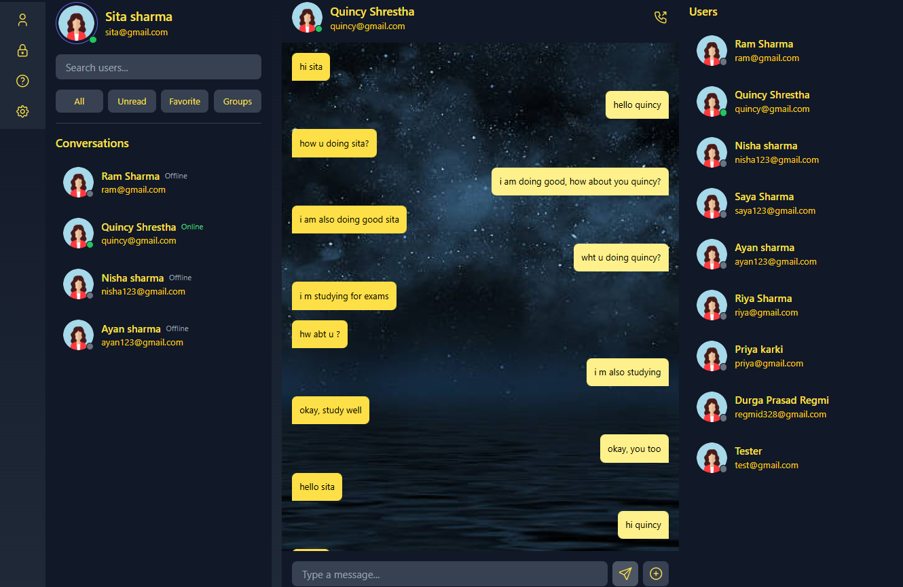

# 💬 Real-Time Chat Application

A modern, responsive, and real-time chat application built with **React.js**, **Node.js**, and **Socket.IO**. It allows users to communicate instantly in a simple and intuitive interface.

🔗 **Live Demo:** [View Application](https://chat-app-brown-xi-79.vercel.app/)

---

## 📌 Features

- ⚡ **Real-Time Messaging** – Instant message delivery using Socket.IO.
- 👥 **User Authentication** – Secure login and signup functionality.
- 🟢 **Online Status** – Shows active/online users in real time.
- 💬 **Private & Group Chats** – Communicate in one-on-one or group conversations.
- 📱 **Responsive UI** – Works seamlessly on desktop, tablet, and mobile.
- 🔒 **Secure Communication** – Safe handling of messages and user data.

---

## 🛠️ Tech Stack

**Frontend:**
- React.js
- Tailwind CSS
- Socket.IO Client

**Backend:**
- Node.js
- Express.js
- Socket.IO
- MongoDB (for storing user data & messages)

---

  ## 📸 Screenshots

> Below are some key screens from LibraryConnect.  

<table>
<tr>
<td><b>Chat Dashboard</b></td>
</tr>
<tr>
<td></td>
</tr>
</table>
